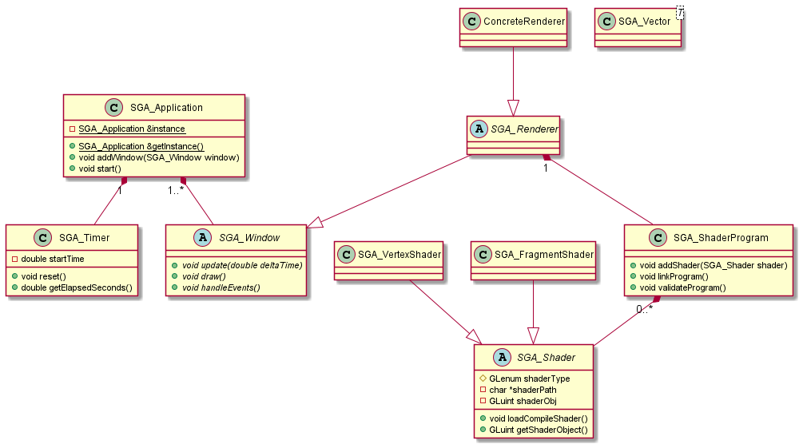

# LearningFreeGlut
Learning freeGlut to implement my mandelbrot renderer in GLSL and develop a simple API that will act as a wrapper for my future projects.

I will be using [this ressource](https://ogldev.org/) during my learning process.

## Install dependencies with pacman
```bash
pacman -Sy mingw-w64-x86_64-freeglut
```
```bash
pacman -Sy mingw-w64-x86_64-glew
```

## UML Diagram
Note: just because something is in the UML diagram doesn't necessarily imply that it has been implemented, but rather that I plan on implementing it.

(generated with PlantUML)